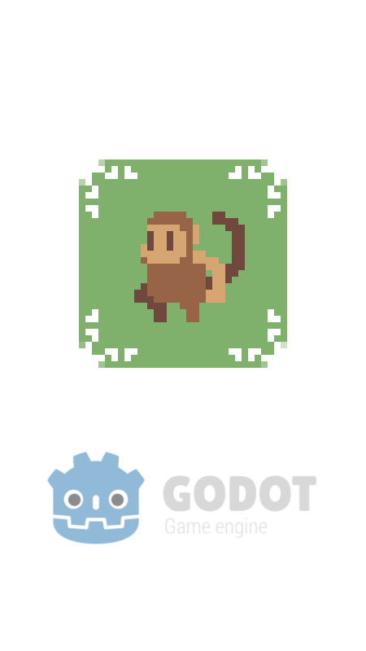

#  Monkiki

[![release][1]][2] [![license][7]][8]

Monkiki is a **Epitech JAM game** for 💻**PC** / 🌐**Web**.

[Epitech JAM 2021](https://www.epitech.eu/) theme is `Past, Present, Future`.

<!---  --->

##  Play on itch.io

Play at **[kiiks.itch.io](https://greendjango.itch.io/monkiki)**

## Install & Setup

1. Download the 💻*binary* from **[releases](https://github.com/GreenDjango/EpitechJAM2021/releases)**
2. Run the app
3. Enjoy with `Monkiki` !
4. Optional: `rm -rf *` for delete all your pc

---

#### Project realised by:
- **[@Louis C.](https://github.com/Kdaudau)** 🦦
- **[@Théo C.](https://github.com/GreenDjango)** 🐙
- **[@Yann M.](https://github.com/Paquity)** 🐤

[1]: https://img.shields.io/badge/release-v0.1.0-blue
[2]: https://github.com/GreenDjango/EpitechJAM2021/releases 'GitHub release (latest by date)'
[7]: https://img.shields.io/badge/license-MIT-green
[8]: https://github.com/GreenDjango/EpitechJAM2021/blob/master/LICENSE 'GitHub license'
